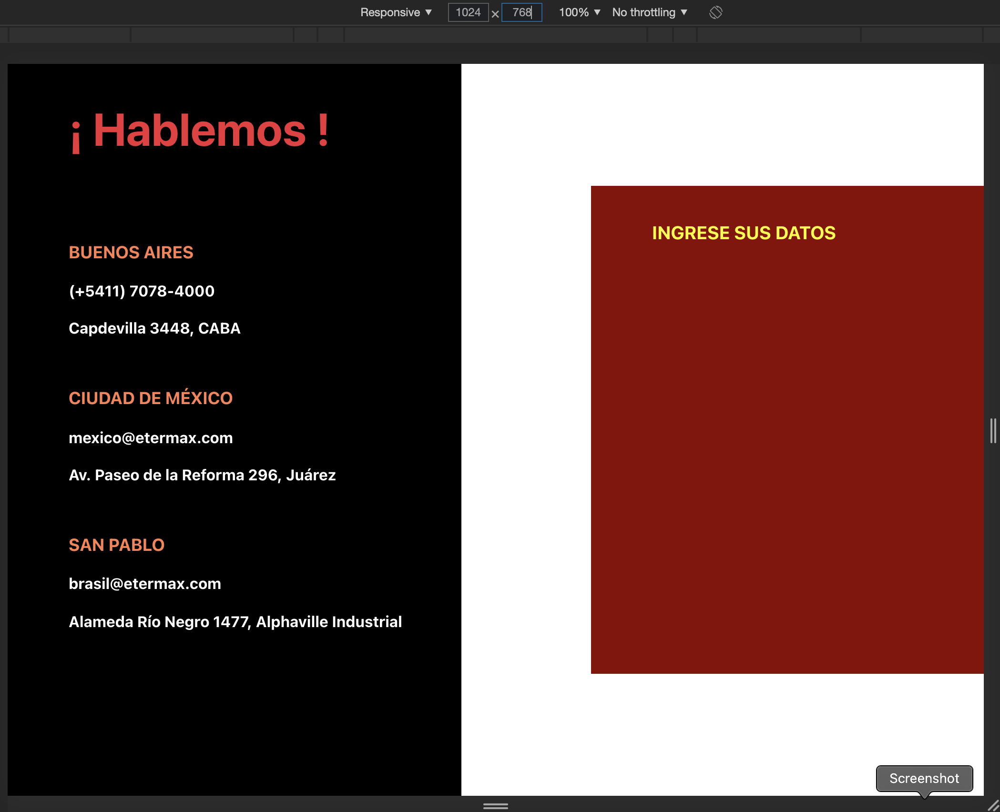

# Sandbox React App

El proyecto se trata de construir una clásica página de contacto, sobre una base pre-hecha parcial.

Todo el código inicial puede ser cambiado, pueden instalarse o remover la librerías que se consideren necesarias.

Inicialmente se trabajará con una pantalla estándard de 1024 x 768.

## Paso 1: El Formulario

Crear formulario en un recuadro rojo, con idéntica proporcion de ancho que el panel negro, pero ocupando sólo la mitad del espacio vertical y a su vez, centrado verticalmente y alineado a la derecha horizontalmente.

Puede utilizarse el tipo de input / select deseado.

Los campos son:

Nombre (requerido) 
Apellido (requerido)
Email (requerido y con estructura de email)
Edad (opcional)

Botón de Enviar (que solo imprima en la consola los datos tipo .json)

Los campos y el botón deben quedar alineados al lado izquierdo del Título del Formulario.
La idea es que el margen inferior del boton esté a una distancia del borde igual al borde superior del título respecto del borde superior del recuadro rojo.

## Paso 2: Campo opcional
Si la edad ingresada es de mas de 40, debe aparecer un cuadro de eleccion de que tipo de vacuna que desea darse:
Sinovac, Pfeizer, Moderna, Jhonson & Jhonson
